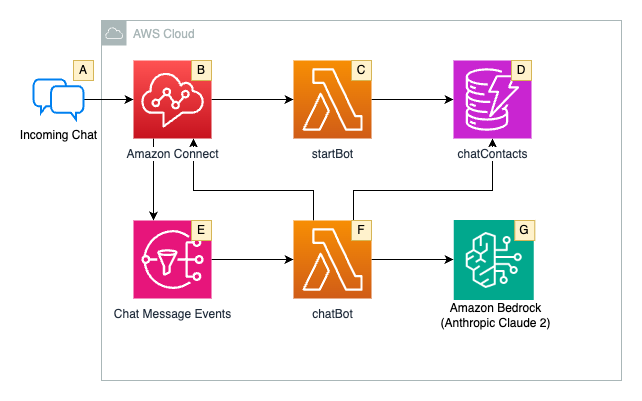
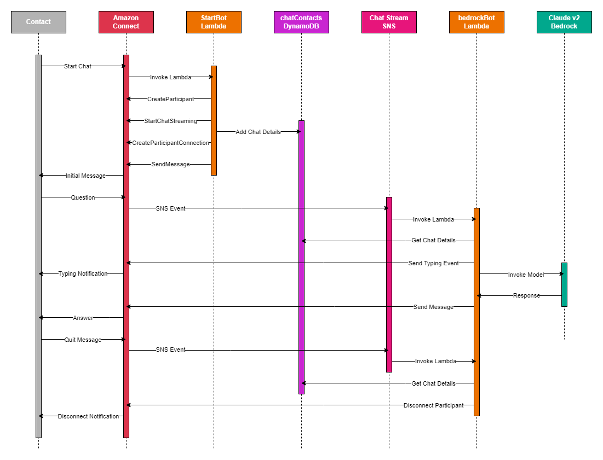

## Amazon Connect Chat With Custom Participants

## Useful commands

* `cdk bookstrap`       preps default AWS account/region for CDK deployments
* `cdk deploy --parameters instanceArn=<instanceArn>`      deploy this stack to your default AWS account/region
* `cdk diff`        compare deployed stack with current state
* `cdk synth`       emits the synthesized CloudFormation template

## Architecture Diagram

## Sequence Diagram

## Security

See [CONTRIBUTING](CONTRIBUTING.md#security-issue-notifications) for more information.

## License

This library is licensed under the MIT-0 License. See the LICENSE file.

